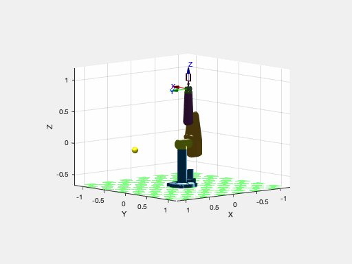

[](https://travis-ci.com/petercorke/robotics-toolbox-matlab)

[](https://www.gnu.org/licenses/lgpl-3.0)
[](https://GitHub.com/petercorke/robotics-toolbox-matlab/graphs/commit-activity)
[](https://GitHub.com/petercorke/robotics-toolbox-matlab/stargazers/)


# Robotics Toolbox for MATLAB&reg; release 10

## Synopsis

This toolbox brings robotics specific functionality to MATLAB, exploiting the native capabilities of MATLAB (linear algebra, portability, graphics).

The Toolbox uses a very general method of representing the kinematics and dynamics of serial-link manipulators as MATLAB®  objects –  robot objects can be created by the user for any serial-link manipulator and a number of examples are provided for well known robots from Kinova, Universal Robotics, Rethink as well as classical robots such as the Puma 560 and the Stanford arm.

The toolbox also supports mobile robots with functions for robot motion models (unicycle, bicycle), path planning algorithms (bug, distance transform, D*, PRM), kinodynamic planning (lattice, RRT), localization (EKF, particle filter), map building (EKF) and simultaneous localization and mapping (EKF), and a Simulink model a of non-holonomic vehicle.  The Toolbox also including a detailed Simulink model for a quadrotor flying robot.

Advantages of the Toolbox are that:
  * the code is mature and provides a point of comparison for other implementations of the same algorithms;
  * the routines are generally written in a straightforward manner which allows for easy understanding, perhaps at the expense of computational efficiency. If you feel strongly about computational efficiency then you can always rewrite the function to be more efficient, compile the M-file using the MATLAB compiler, or create a MEX version;
  * since source code is available there is a benefit for understanding and teaching.
  
This Toolbox dates back to 1993 and significantly predates the [Robotics Systems Toolbox&reg;](https://www.mathworks.com/products/robotics.html) from MathWorks.  The former is free, open and not supported, while the latter is a fully supported commercial product.

## Code Example

```matlab
>> mdl_puma560
>> p560
p560 = 

Puma 560 [Unimation]:: 6 axis, RRRRRR, stdDH, fastRNE            
 - viscous friction; params of 8/95;                             
+---+-----------+-----------+-----------+-----------+-----------+
| j |     theta |         d |         a |     alpha |    offset |
+---+-----------+-----------+-----------+-----------+-----------+
|  1|         q1|          0|          0|     1.5708|          0|
|  2|         q2|          0|     0.4318|          0|          0|
|  3|         q3|    0.15005|     0.0203|    -1.5708|          0|
|  4|         q4|     0.4318|          0|     1.5708|          0|
|  5|         q5|          0|          0|    -1.5708|          0|
|  6|         q6|          0|          0|          0|          0|
+---+-----------+-----------+-----------+-----------+-----------+
 
>> p560.fkine([0 0 0 0 0 0])  % forward kinematics
ans = 
         1         0         0    0.4521
         0         1         0     -0.15
         0         0         1    0.4318
         0         0         0         1
```

We can animate a path
```matlab
mdl_puma560

p = [0.8 0 0];
T = transl(p) * troty(pi/2);
qr(1) = -pi/2;
qqr = p560.ikine6s(T, 'ru');
qrt = jtraj(qr, qqr, 50);

plot_sphere(p, 0.05, 'y');
p560.plot3d(qrt, 'view', ae, 'movie', 'move2ball.gif');
```



## What's new

* all code related to pose representation has been split out into the [Spatial Math Toolbox](https://github.com/petercorke/spatial-math).
* `SerialLink` class has a `twists` method which returns a vector of `Twist` objects, one per joint.  This supports the product of exponential formulation for forward kinematics and Jacobians.
* a prototype URDF parser

## Installation from github

You need to have a recent version of MATLAB, R2016b or later.

The Robotics Toolbox for MATLAB has dependency on two other repositorys `spatial-math` and `toolbox-common-matlab`.  

To install the Toolbox on your computer from github follow these simple instructions.

From the shell:

```shell
% mkdir rvctools
% cd rvctools
% git clone https://github.com/petercorke/robotics-toolbox-matlab.git robot
% git clone https://github.com/petercorke/spatial-math.git sm
% git clone https://github.com/petercorke/toolbox-common-matlab.git common
% mv common/startup_rvc.m .
```

Then, from within MATLAB
```matlab
>> cd rvctools  % this is the same folder as above
>> startup_rvc
```
The second line sets up the MATLAB path appropriately but it's only for the current session.  You can either:
1. Repeat this everytime you start MATLAB
2. Add it to your `startup.m` file
3. Once you have run startup_rvc, run `pathtool` and push the `Save` button


## Online resources:

* [Home page](http://www.petercorke.com)
* [Discussion group](http://groups.google.com/group/robotics-tool-box?hl=en)

Please email bug reports, comments or code contribtions to me at rvc@petercorke.com
  

## Contributors

Contributions welcome.  There's a user forum at http://tiny.cc/rvcforum

## License

This toolbox is released under GNU LGPL.
